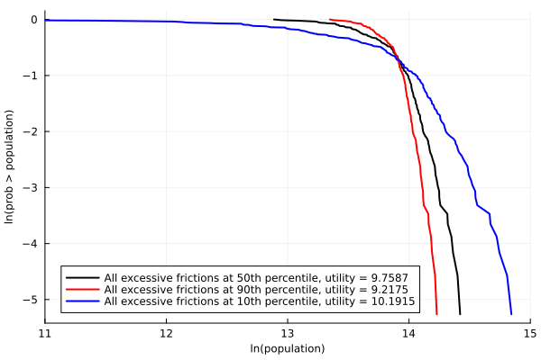

## DRH_replication.jl: Replicate results from Desmet and Rossi-Hansberg (2013)
This package replicates 5 results from Song et al. (2011), including Figures 2, 3, 4, 8 and 9. 

## How to Install and Use the Package 
- Step 1: Open the Julia REPL
- Step 2: Enter the Julia package manager by typing ']'
- Step 3: Enter the following command into the Julia package manager: 
    'add https://github.com/peteratkatchenko/DRH_replication.jl'
- Step 4: Exit the Julia package manager and return to the Julia REPL by typing 'Backspace'
- Step 5: Enter the following command into the Julia REPL:
    'using DRH_replication'
- Step 6: Execute the following command:
    'drh_replicate()'
Following execution of the 'glc_replicate()' function in the Julia REPL, the file path that leads to the directory containing the resulting images will be printed. Open the indicated directory on your machine and enjoy the beautiful graphs! 

## Breakdown of the Constituent Scripts

### `DRH_replication.jl`
- **Purpose**: This is the primary module of the package. It cals all of the scripts that constitute the replication.

### `InputsNumericalUS.jl`
- **Purpose**: The existing data on Metropolitan Statistical Areas in the USA is cleaned and reshaped before being employed to calculate the average population, average logarithm of city efficiency and average logarithm of excess city frictions over the sample period. This data is then saved for use in the UAWMainUSA scripts. 

### `InputsNumericalChina.jl`
- **Purpose**: Similarly, the existing data for a set of prefecture-level cities in China is cleaned and reshaped before being employed to calculate the population, logarithm of city efficiency and logarithm of excess city frictions in 2005. This data is then saved for use in the UAWMainChina scripts.

### `UAWMainUSA23.jl`
- **Purpose**: This script calculates the actual distribution of city sizes in the US, in addition to solving the nonlinear equation presented in Equation (19) of Section III of the publication for the counterfactual distributions of city sizes that prevail under a variety of city characteristic combinations. The script first calculates the counterfactual city size distributions constituting Figure 2. Three counterfactual exercizes are conducted, with each involving the equivalence of one of three city characteristics, ie city efficiency, amenities or excessive frictions. The script then calculates the counterfactual city size distributions constituting Figure 3. Similarly, three counterfactual exercizes are conducted, with each involving the the equivalence of two of three city characteristics. 

### `UAWMainUSA4.jl`
- **Purpose**: This script repeats the third counterfactual exercize presented in Figure 2, in which excessive frictions are made identical across all cities. However, it conducts the counterfactual exercize three times, assuming three differing levels of the excessive frictions, corresponding to the 10th, 50th and 90th percentile of the distribution of excessive frictions across the cities.

### `UAWMainChina8.jl`
- **Purpose**: This script conducts the same counterfactual exercizes as those conducted for Figure 2, only now the model is applied to data for Chinese prefecture-level cities. Namely, three counterfactual exercizes are conducted, with each involving the equivalence of one of three city characteristics, ie city efficiency, amenities or excessive frictions. 

### `UAWMainChina9.jl`
- **Purpose**: This script conducts the same counterfactual exercizes as those conducted for Figure 4, only now the model is applied to data for Chinese prefecture-level cities. Namely, the script repeats the third counterfactual exercize in Figure 8, in which excessive frictions are made identical across all surveyed Chinese prefecture-level cities. However, it conducts the counterfactual exercize three times, assuming three differing levels of the excessive frictions, corresponding to the 10th, 50th and 90th percentile of the distribution of excessive frictions across the cities. 

### `Nsys*.jl`
- **Purpose**: This collection of scripts contains all of the counterfactual versions of the nonlinear equation presented as Equation (19) in Section III of the publication. Each function corresponds to a counterfactual exercize that is conducted in the scripts discussed above. The nonlinear equation is solved numerically for the distribution of city sizes given a set of exogeneous parameter values and a set of counterfactual conditions pertaining to three key city characteristics, ie city efficiency, amenties or excessive frictions.

## Figures Produced by the Replication

**Figure 2**：

**Figure 3**: 

**Figure 4**：

**Figure 8**：

**Figure 9**：

## Want to Execute the Code Manually?
- Step 1: Download the package files to a common directory 
- Step 2: Open the file called 'DRH_replication.jl'
- Step 3: Remove the function wrapper for 'drh_replicate'
- Step 4: Execute 'DRH_replication.jl' - this module will automatically call all other files in the package and generate the appropriate images